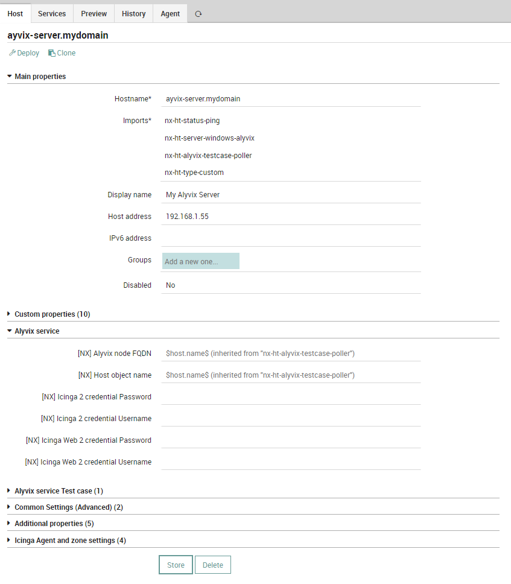
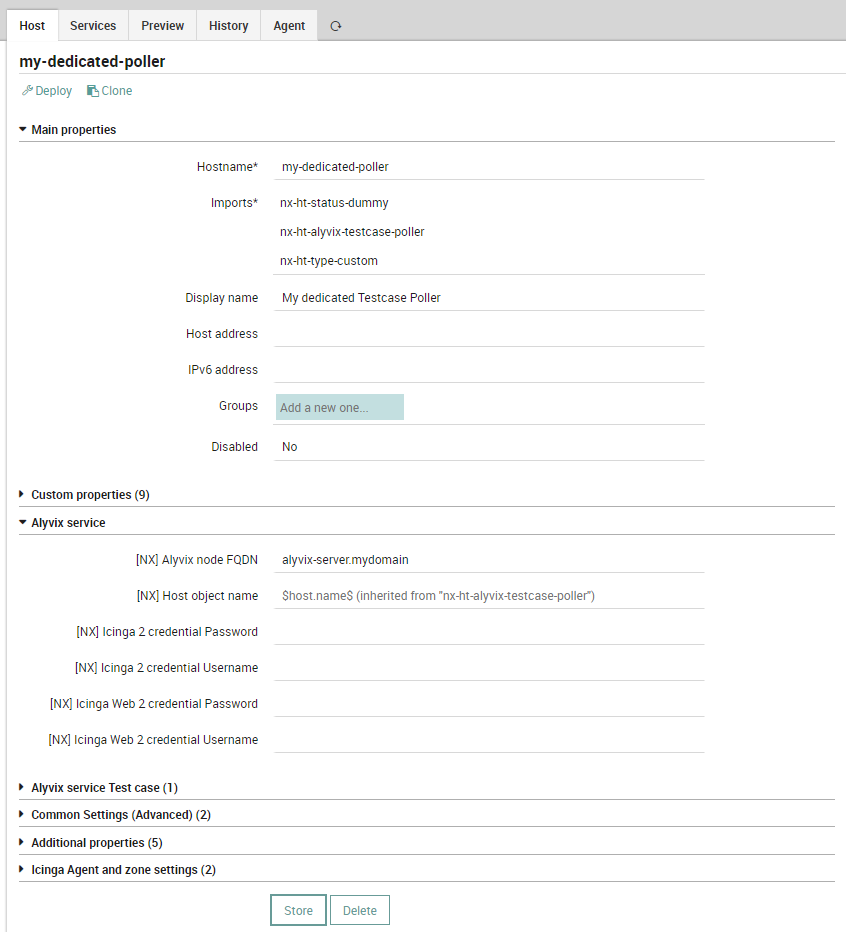
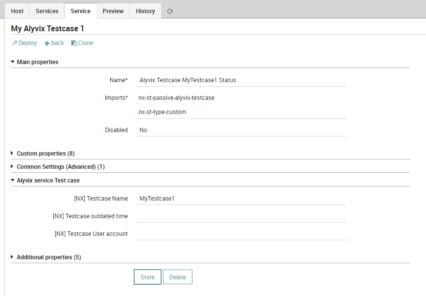

# NEP Alyvix Service
The `nep-alyvix package` is the NEP designed to monitoring the Alyvix testcases and the server where this testcases run. It provides a quite complete monitoring for all the components. With nep-alyvix it is possible to perform monitoring of:

* Alyvix Service more info on [Official Documentation.]{https://alyvix.com/learn/service/}

This package can monitor Alyvix Testcases and servers based on Alyvix Service. Old Alyvix Server can still be monitored, but since it is deprecated its monitoring is discouraged, since an upgrade to latest Alyvix Service version is highly suggested.

# Table of Contents
1. [Prerequisites](#prerequisites)
2. [Installation](#installation)
3. [Packet Contents](#packet-contents)
4. [Usage](#usage)


## Prerequisites

| Sofware Version | Version |
| --- | ----------- |
| NetEye | 4.31 |
| nep-common | 0..0.9 |


##### Required NetEye Modules

| NetEye Module |
| --- |
| CORE |
| alyvix |


### External dependencies

This NEP doesn't need any external dependecies other that the ones used by the NEPs reported in [Prerequisites](#prerequisites)


## Installation

#### Before Installation

There is no need to perform any action before installing this NEP


### NEP Installation

To install the `nep-alyvix`, use `nep-setup` via SSH on NetEye Master Node:
```
nep-setup install nep-alyvix
```


#### Finalizing Installation

There is no need to perform any action to complete the installation of this NEP


## Packet Contents

### Director/Icinga Objects

This NEP doesn't provide any Director/Icinga object


#### Host Templates

The following Host Templates can be used to freely create Host Objects.

_Remember to not edit these Host Templates because they will be restored/updated at the next NEP package update_:

* `nx-ht-server-windows-alyvix`: Describe a generic Windows-based server computer monitored by an Icinga 2 Agent running Alyvix Service
* `nx-ht-alyvix-testcase-poller`: Provide Test cases monitoring services in addition to `nx-ht-server-windows-alyvix`


#### Service Templates

The following Service Templates can be used to freely create Service Objects, Service Apply Rules or Service Sets.

_Remember to not edit these Service Templates as they will be restored/updated at the next NEP Package update_:

* `nx-st-passive-alyvix-testcase`: Passive service to monitor a specific Test case


#### Services Sets

The following Service Sets can be used to freely monitor Host Objects.

_Remember to not edit these Service Sets because they will be restored/updated at the next NEP Package update_:

* `nx-ss-alyvix-server-status`: Provide common monitoring for a Windows-based server running Alyvix Service
* `nx-ss-alyvix-testcase-poller`: Provide default Test case Poller service for Shared or Dedicated poller


#### Command

This NEP doesn't provide any command


#### Notification

This NEP doesn't provide any Notification definition


### Automation

This NEP doesn't provide any Automation


### Tornado Rules

This NEP doesn't provide any Tornado rules


### Dashboard ITOA

This NEP doesn't provide any ITOA Dashboards


### Metrics

This NEP doesn't generate any Performance Data from its commands


## Usage

### Monitor Alyvix Service Server

Now you can start checking the health of your Alyvix Server by creating a dedicated Host Object

Create a new Host in the Icinga Director as mentioned in [Monitor an example environment]{https://neteye.guide/current/nep/doc/getting-started/nep-getting-started.html#monitor-an-example-environment}:

* Use the FQDN of the server as Hostname
* Use Host Templates `nx-ht-status-ping`, `nx-ht-server-windows-alyvix`, `nx-ht-type-custom` in that same order
* Store and deploy

As a result, a newly created Host will appear in the NetEye Overview, with all the available checks being already preconfigured, including the specific check provided by the `nep-alyvix`: Service Alyvix service status. This is a basic check and is used to ensure the Alyvix Service is running. If you don’t need to take care of specific access policies (like multi-tenancy or roles), you can configure this Host Object as a Shared poller (see p.4.Configure a Test Case Poller) by adding the requierd Host Template and Service Objects

### Configure a Test Case Poller

To get the status of each Test Case running in the system a poller script is used. In order to allow a Host object to monitor Test Cases, define a Host as a Poller, providing specific Host Templates based on its type - Shared or Dedicated

To configure a Host as a _Shared Poller_ add `nx-ht-alyvix-testcase-poller` template in the Host Imports

_Note It is important that the `nx-ht-alyvix-testcase-poller` template is placed before the `nx-ht-type-custom template` in the Imports menu_

A _Dedicated Poller_ is to be used in the cases of a multitenant environment, i.e. the status of a particular Test Case should be available only to the users belonging to a Tenant the Test case is running on

Additionally, you can use a dedicated poller for organizing a large number of Test Cases for an easier access to their status

To configure a Host as a _Dedicated Poller_

* Use `nx-ht-status-dummy` Host Template
* Sequentially, add `nx-ht-alyvix-testcase-poller` template in the Host Imports
* Specify the name of the Alyvix Server that runs a Test Case to be monitored, use `[NX] Alyvix node FQDN field`

As a Poller is being configured, Testcase Poller, an active service that allows the monitoring Service to run, is automatically created. In case the status of the service is other than OK, no further monitoring can be run

### Poller Authentication

You will also need two accounts to connect to one of the Poller types. These accounts are used by Testcase Poller to get and report status of the desired Test cases (see below)

To connect to these accounts, you will need to provide credentials under the Alyvix Service section details.

The first account is the <strong>alyvix-check</strong>, and the password to this account is contained in the file `.pwd_icinga2_alyvix_check`, which is to be created upon the setup of nep-alyvix. Run the following command to obtain the password:
```
cat /root/.pwd_icinga2_alyvix_check
```
Another account is also provided upon the setup procedure, with the username being still the same <strong>alyvix-check</strong>, and the password contained in the file `.pwd_icingaweb2_alyvix_check`. Run the following command to obtain the password:
```
cat /root/.pwd_icingaweb2_alyvix_check
```

### Create individual Service Object for each Test Case to be monitored

In order to define which Test Cases are to be monitored, configure a Service using the following templates, keeping the exact same order: `nx-st-passive-alyvix-testcase` and `nx-st-type-custom`

Next, you have to define a Service Name in the format: _Alyvix Testcase test case name Status_, and define the name of the Test Case to monitor in the Alyvix Service Test Case section detail.

_Note Please note that a dedicated Service is to be created for each Test case you would like to monitor_

As result, a new Service will be created, i.e. _Alyvix Testcase test case name Status_, a passive Service with no active check enabled

The results of a Test Case monitoring process are available in the Service’s Plugin Output
