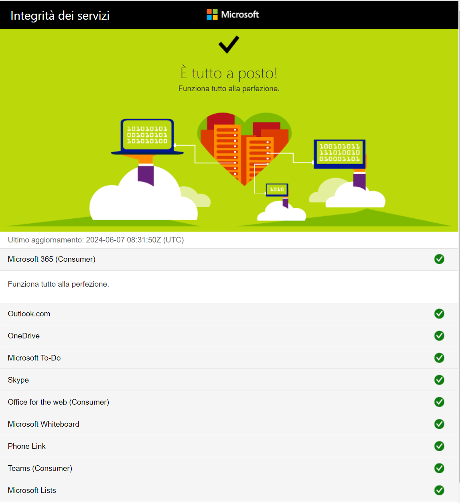
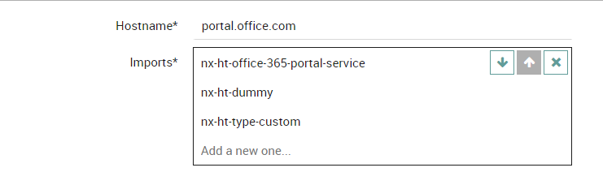
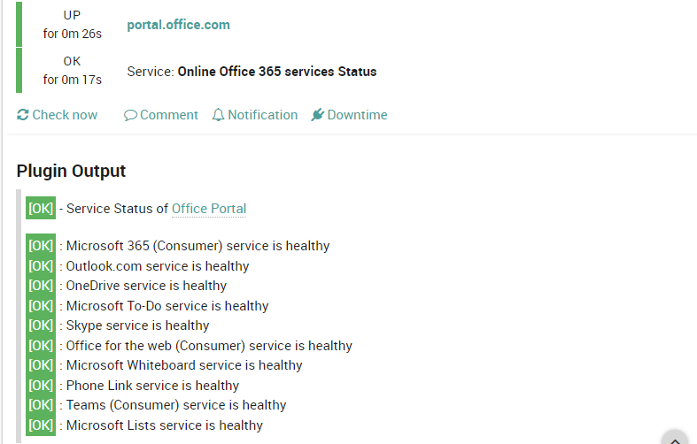
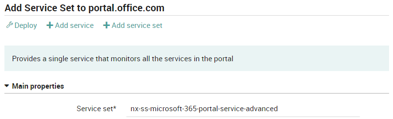
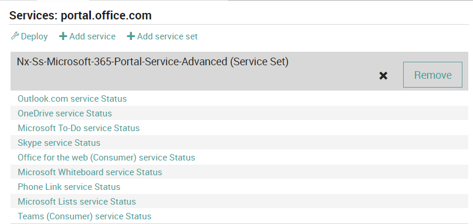
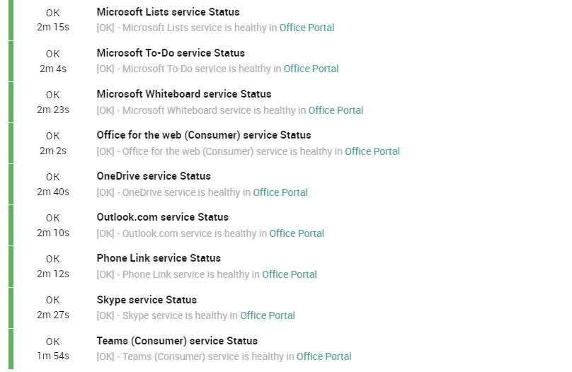
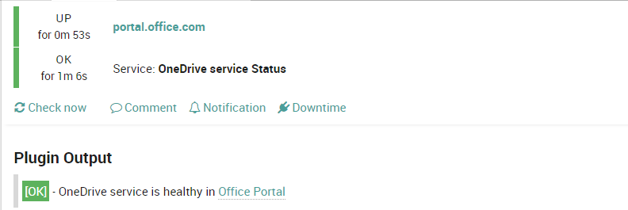

# nep-microsoft-365-portal

The `nep-microsoft-365-portal` is developed in order to provide a simple tool for monitoring the status of Office 365 online services that are reported at: **https://portal.office.com/servicestatus**



This NEP calls API at https://portal.office.com/api/servicestatus/index and uses this python3 library

*  [python3-xmltodict](https://pypi.org/project/xmltodict/)

*This NEP can be also as example in order to develp advanced XML tests by customizing the logic inside the python script.*

# Table of Contents
1. [Prerequisites](#prerequisites)
2. [Installation](#installation)
3. [Packet Contents](#packet-contents)
4. [Usage](#usage)

## Prerequisites

| Sofware Version | Version |
| --- | ----------- |
| NetEye | 4.32 |
| nep-common | 0.1 |

##### Required NetEye Modules

| NetEye Module |
| --- |
| Core |

### External dependencies

This NEP needs these external dependecies other that the ones used by the NEPs reported in [Prerequisites](#prerequisites)

* Access to the epel repository (granted by nep-common)

## Installation

The installation process provides a Python script `check_office_services.py` that is automatically installed at `/neteye/shared/monitoring/plugins/`

### NEP Installation

To install the NEP, run this command using SSH on NetEye Master Node:
```
nep-setup install nep-microsoft-365-portal
```

#### Finalizing Installation

There is no need to perform any action to complete the installation of this NEP.

*Maybe it will be usefull manually run the script in order to check the compatibility with your OS.*
```
/neteye/shared/monitoring/plugins/check_office_services.py -p 'https://portal.office.com/api/servicestatus/index' -m all
```

## Packet Contents

The NEP contains 4 baskets :

* nep-microsoft-365-portal-02-command.json
* nep-microsoft-365-portal-03-host.json
* nep-microsoft-365-portal-04-service.json
* nep-microsoft-365-portal-05-serviceset.json

A pre installation bash script for installing the python3 library:

* install_missing_rpm.sh

The Python3 Script:

* check_office_services.py


### Director/Icinga Objects

This NEP provides some basic Icinga objects used to speedup the configuration

#### Host Templates

This NEP provides a single Host Template definition, that must be applied to the desiderd host:

* nx-ht-office-365-portal-service

#### Service Templates

This NEP provides a Service Template definition that can be used to obtain one or all the services status information

* nx-st-agentless-office365-portal-service

#### Services Sets

This NEP provides 2 Service Set definition, one that provides a single service with all servicese status. An advanced Service Set where all Office Services are splitted in Icinga Services

* nx-ss-microsoft-365-portal-service-basic
* nx-ss-microsoft-365-portal-service-advanced (this one can be manually added)

#### Command

Command Templates:

* nx-c-check-office-services based on `check_office_services.py` that can be customized by `-p` and `-m`

Where

* `-p` is the portal URL
* `-m` mode of the check, all services or a specific-one: all, Oulook.com, OneDrive

### Metrics

This NEP doesn't generate any Performance Data from its commands


## Usage

In order to enable this nep, create an host and assign the proper HT `nx-ht-office-365-portal-service`:



By default a SS with a Single Service is applied:


This service monitors all the Office-Portal Service in one:



If you want to split the services add the advanced SS `nx-ss-microsoft-365-portal-service-advanced` to the host:





And the final result is:



### Examples

In addtion yuo can chose to monitor only one services of the Office Portal, i.e. OneDrive:


