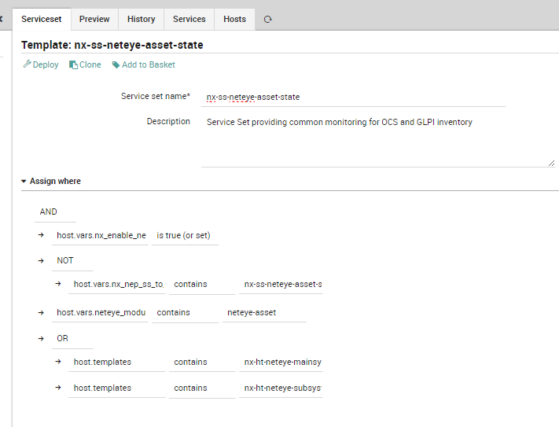
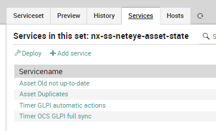
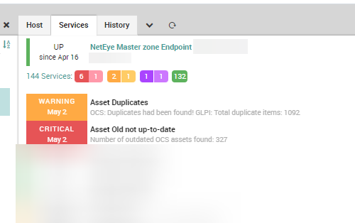

# NEP NAME
The `nep-monitoring-asset` provides the minimum requirements to implement a basic monitoring of a NetEye Asset Management services based on GLPI and OCSInventory. With `nep-monitoring-asset` it is possible to perform standard monitoring of:
* Service availability
* Assets information

Using the provided objects, is possible to:
* Service Set providing common monitoring for OCS and GLPI inventory
* Check Old not up-to-date assets in OCS and GLPI
* Checks OCS and GLPI duplicate assets

# Table of Contents
1. [Prerequisites](#prerequisites)
2. [Installation](#installation)
3. [Packet Contents](#packet-contents)
4. [Usage](#usage)


## Prerequisites

| Software Version      | Version |
| --------------------- | ------- |
| NetEye                | 4.25    |
| `nep-common`          | 0.0.4   |
| `nep-monitoring-core` | 0.0.6   |


##### Required NetEye Modules

| NetEye Module |
| ------------- |
| `Core`        |
| `Asset`       |


### External dependencies

This Package requires a readonly user on Glpi database [MariaDB KB](https://mariadb.com/kb/en/create-user/)


## Installation

#### Before Installation

There is no need to perform any action before installing this NEP

### NEP Installation

If all requirements are met, you can now install this package. To manually set up the `nep-monitoring-asset` package, just use `nep-setup` utility to install it.

```bash
nep-setup install nep-monitoring-asset
```

Once installed the configuration file `/usr/lib64/neteye/monitoring/plugins/check_inventory.pl` should be updated with readonly user parameters.

#### Finalizing Installation

There is no need to perform any action to complete the installation of this NEP


## Packet Contents

This section contains a description of all the Objects from this package that can be used to build your own monitoring environment.


### Director/Icinga Objects

The Package contains the following Director Objects.

#### Data Lists

The following Data Lists can be freely customized by the End User. Their purpose is to provide easy data filling to better describe the monitoring environment.

| Datalist Name               | Description                                                             |
| --------------------------- | ----------------------------------------------------------------------- |
| [NX] Inventory Command List | Used to provide the list of check available for check_inventory command |

#### Host Templates

This NEP doesn't provide any Host Template definition.

#### Service Templates

The following Service Templates can be used to freely create Service Objects, Service Apply Rules or Service Sets. Remember to not edit these Service Templates because they will be restored/updated at the next NEP Package update.

| Template Name                     | Run on Agent | Description                                              |
| --------------------------------- | ------------ | -------------------------------------------------------- |
| `nx-st-agentless-inventory`       | No           | Checks all aspects of monitoring of NetEye Asset service |
| `nx-st-agent-linux-systemd-timer` | Yes          | Check SystemD Timers scheduled                           |


#### Services Sets

The following Service Sets can be used to freely monitor Host Objects.

_Remember to not edit these Service Sets because they will be restored/updated at the next NEP Package update._

| Service Set Name           | Description                                                        |
| -------------------------- | ------------------------------------------------------------------ |
| `nx-ss-neteye-asset-state` | Service Set providing common monitoring for OCS and GLPI inventory |


#### Command

This NEP provide the following commands:

* `nx-c-check-inventory`
* `nx-c-check-systemd-timer`


#### Notification

This NEP doesn't provide any Notification definition

### Automation

This NEP doesn't provide any Automation

### Tornado Rules

This NEP doesn't provide any Tornado rules


### Dashboard ITOA

This NEP doesn't provide any ITOA Dashboards


### Metrics

This NEP doesn't generate any Performance Data from its commands


## Usage

### Examples

#### Using a host template provided by the NEP

This NEP doesn't have any Host Template

#### Using a service set provided by the NEP

Definition:


Services List in Service Set:


Result in Icinga Overview:
