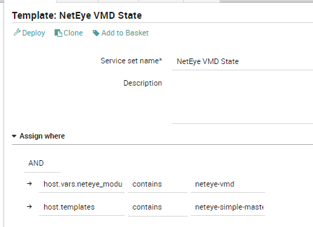

# NEP Monitoring VMD
The `nep-monitoring-vmd` package is the NEP designed to monitor the state of VMD service.

# Table of Contents
1. [Prerequisites](#prerequisites)
2. [Installation](#installation)
3. [Packet Contents](#packet-contents)
4. [Usage](#usage)


## Prerequisites

| Software Version    | Version |
| ------------------  | ------- |
| NetEye              | 4.25    |
| nep-common          | 0.0.4   |
| nep-monitoring-core | 0.0.6   |


##### Required NetEye Modules

| NetEye Module |
| ------------  |
| Core          |
| VMD           |


### External dependencies

This NEP doesn't need any external dependencies other that the ones used by the NEPs reported in [Prerequisites](#prerequisites)


## Installation

#### Before Installation

There is no need to perform any action before installing this NEP


### NEP Installation

To install the `nep-monitoring-vmd`, use `nep-setup` via SSH on NetEye Master Node:
```bash
nep-setup install nep-monitoring-vmd
```


#### Finalizing Installation

There is no need to perform any action to complete the installation of this NEP


## Packet Contents

### Director/Icinga Objects

This NEP provide the following Director objects.


#### Host Templates

This NEP doesn't provide any Host Template definition


#### Data Lists

This NEP doesn't provide any Data List.


#### Service Templates

This NEP doesn't provide any Service Template definition.


#### Services Sets

The following Service Sets can be used to freely monitor Host Objects.

_Remember to not edit these Service Sets because they will be restored/updated at the next NEP Package update_:

* `nx-ss-neteye-vmd-state`: Service Set providing common monitoring for VMD Module
  * Unit Icinga-VsphereDB State

#### Command

This NEP doesn't provide any Command definition.


#### Notification

This NEP doesn't provide any Notification definition.


### Automation

This NEP doesn't provide any Automation.


### Tornado Rules

This NEP doesn't provide any Tornado rules.


### Dashboard ITOA

This NEP doesn't provide any ITOA Dashboards.


### Metrics

This NEP doesn't generate any Performance Data from its commands.


## Usage


### Examples

Service Set Definition:


#### Using a host template provided by the NEP

No Host Template provided by this NEP.


#### Using a service template provided by the NEP

No Service Template provided by this NEP.

