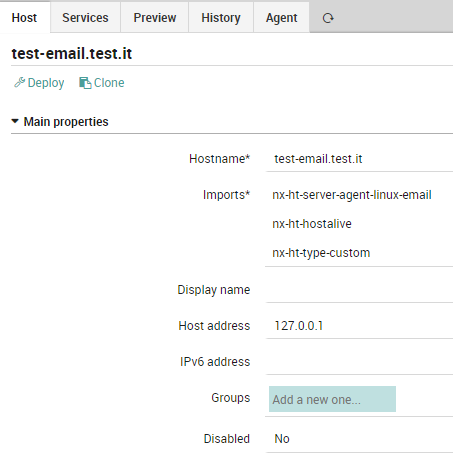
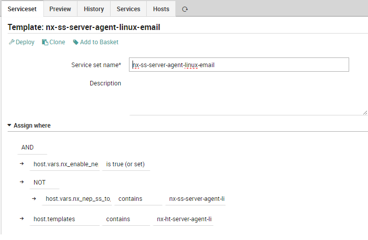
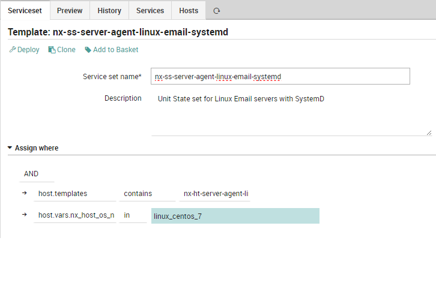

# NEP Server Email
The `nep-server-email` provides the minimum requirements to implement a monitoring of Email Server (receive/send) on Windows and Linux systems.

Using the provided objects, is possible to:

checks incoming email on a specific Mailbox

check outgoing email on a specific Mailbox

check Email Server state (Postfix on Linux, Exchange on Windows)


# Table of Contents
1. [Prerequisites](#prerequisites)
2. [Installation](#installation)
3. [Packet Contents](#packet-contents)
4. [Usage](#usage)


## Prerequisites

| Sofware Version | Version |
| --- | ----------- |
| NetEye | 4.23 |
| nep-common | 0..0.4 |


##### Required NetEye Modules

| NetEye Module |
| --- |
| CORE |


### External dependencies

This NEP doesn't need any external dependecies other that the ones used by the NEPs reported in [Prerequisites](#prerequisites)


## Installation

#### Before Installation

There is no need to perform any action before installing this NEP


### NEP Installation

To install the `nep-server-email`, use `nep-setup` via SSH on NetEye Master Node:
```
nep-setup install nep-server-email
```


#### Finalizing Installation

There is no need to perform any action to complete the installation of this NEP


## Packet Contents

### Director/Icinga Objects

This NEP doesn't provide any Director/Icinga object


#### Host Templates

The following Host Templates can be used to freely create Host Objects.

_Remember to not edit these Host Templates because they will be restored/updated at the next NEP package update_:

* `nx-ht-server-agent-linux-email`: Describe a generic Linux email Server.


#### Service Templates

The following Service Templates can be used to freely create Service Objects, Service Apply Rules or Service Sets.

_Remember to not edit these Service Templates as they will be restored/updated at the next NEP Package update_:

* `nx-st-agentless-email-receive`: Checks email receive from Email Server
* `nx-st-agentless-email-send`: Checks email sending from Email Server


#### Services Sets

The following Service Sets can be used to freely monitor Host Objects.

_Remember to not edit these Service Sets because they will be restored/updated at the next NEP Package update_:

* `nx-ss-server-agent-linux-email`: Service Set providing common monitoring for Linux Email Server
    * Email Receive
    * Email Send
* `nx-ss-server-agent-windows-email`: Service Set providing common monitoring for Windows Email Server
    * Email Receive
    * Email Send
* `nx-ss-server-agent-linux-email-init`: Service Set for monitor Postfix Service
    * Unit Postfix State
* `nx-ss-server-agent-linux-email-systemd`: Service Set for monitor Postfix Service
    * Unit Postfix State


#### Command

The following Commands can be used to freely create Command Objects, Command Template and Service Template.

_Remember to not edit these Service Templates as they will be restored/updated at the next NEP Package update_:

* `nx-c-check-imap-receive`
* `nx-c-check-smtp-send`


#### Notification

This NEP doesn't provide any Notification definition


### Automation

This NEP doesn't provide any Automation


### Tornado Rules

This NEP doesn't provide any Tornado rules


### Dashboard ITOA

This NEP doesn't provide any ITOA Dashboards


### Metrics

This NEP doesn't generate any Performance Data from its commands


## Usage


### Examples

#### Using a host template provided by the NEP



#### Using a service template provided by the NEP

Example of Service Set `nx-ss-server-agent-linux-email`:



Example of Service Set `nx-ss-server-agent-linux-email-init`:



Example of Service Set `nx-ss-server-agent-linux-email-systemd`:

