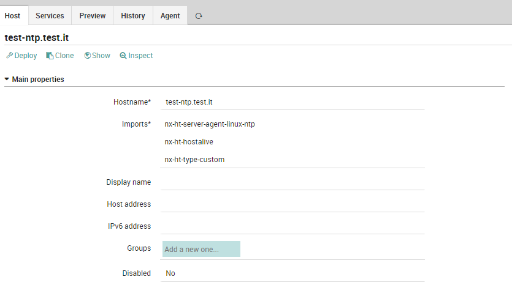
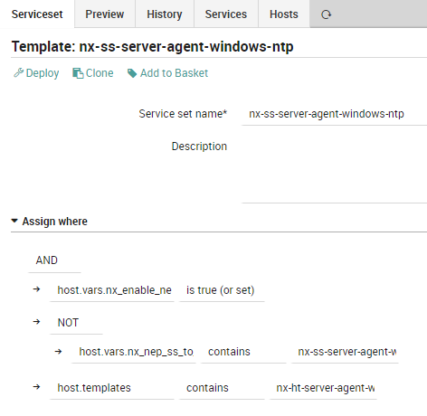
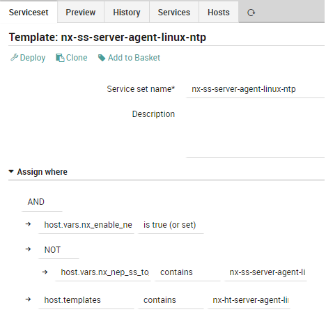

# NEP Server NTP
The nep-server-ntp provides the minimum requirements to implement a monitoring of NTP Server

Using the provided objects, is possible to:

Perform ntp service checks on Windows Server
Perform ntp service checks on Linux Server


# Table of Contents
1. [Prerequisites](#prerequisites)
2. [Installation](#installation)
3. [Packet Contents](#packet-contents)
4. [Usage](#usage)


## Prerequisites

| Sofware Version | Version |
| --- | ----------- |
| NetEye | 4.23 |
| nep-common | 0..0.4 |


##### Required NetEye Modules

| NetEye Module |
| --- |
| CORE |


### External dependencies

This NEP doesn't need any external dependecies other that the ones used by the NEPs reported in [Prerequisites](#prerequisites)


## Installation

_Lorem ipsum dolor sit amet, consectetur adipiscing_


#### Before Installation

There is no need to perform any action before installing this NEP


### NEP Installation

To install the `nep-server-ntp`, use `nep-setup` via SSH on NetEye Master Node:
```
nep-setup install nep-server-ntp
```


#### Finalizing Installation

There is no need to perform any action to complete the installation of this NEP


## Packet Contents

### Director/Icinga Objects

This NEP doesn't provide any Director/Icinga object


#### Host Templates

The following Host Templates can be used to freely create Host Objects.

_Remember to not edit these Host Templates because they will be restored/updated at the next NEP package update_:

* `nx-ht-server-agent-linux-ntp`: Describe a generic Windows NTP Server
* `nx-ht-server-agent-windows-ntp`: Describe a generic Linux NTP Server


#### Service Templates

The following Service Templates can be used to freely create Service Objects, Service Apply Rules or Service Sets.

_Remember to not edit these Service Templates as they will be restored/updated at the next NEP Package update_:

* `nx-st-agentless-ntp`: Checks all aspects of monitoring of a NTP Server


#### Services Sets

The following Service Sets can be used to freely monitor Host Objects.

_Remember to not edit these Service Sets because they will be restored/updated at the next NEP Package update_:

* `nx-ss-server-agent-linux-ntp`: Service Set providing common monitoring for Linux NTP Server
    * Service CHRONYD Status
    * System time Drift Status
* `nx-ss-server-agent-windows-ntp`: Service Set providing common monitoring for Windows NTP Server
    * Service Win32Time Status
    * System time Drift Status


#### Command

This NEP doesn't provide any Command-related object


#### Notification

This NEP doesn't provide any Notification definition


### Automation

This NEP doesn't provide any Automation


### Tornado Rules

This NEP doesn't provide any Tornado rules


### Dashboard ITOA

This NEP doesn't provide any ITOA Dashboards


### Metrics

This NEP doesn't generate any Performance Data from its commands


## Usage


### Examples

#### Using a host template provided by the NEP



#### Using a service template provided by the NEP

Example of Service Template `nx-ss-server-agent-windows-ntp`:



Example of Service Template `nx-ss-server-agent-linux-ntp`:

