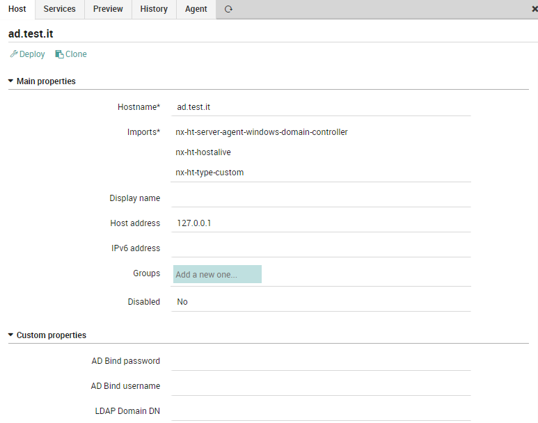
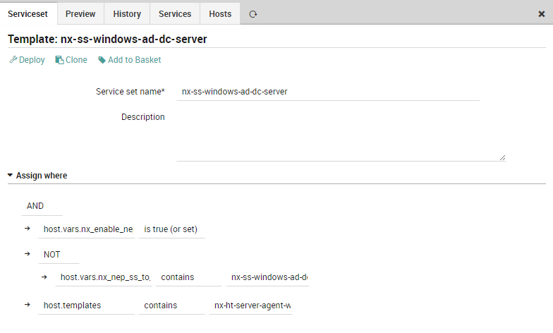

# NEP Windows Domain Controller
The `nep-windows-active-directory` provides the monitoring of Windows Domain Controller Server .

Using the provided objects, is possible to:

* Service AD Domain Services Status
* Service AD Web Services Status
* Service DFS Replication Status
* Service Group Policy Client Status
* Service Kerberos Key Distribution Center Status
* Service SMB Server Status
* Domain DCs LDAP query
* Domain DCs LDAP GC query
* AD DC Status
* AD Replication Status

# Table of Contents
1. [Prerequisites](#prerequisites)
2. [Installation](#installation)
3. [Packet Contents](#packet-contents)
4. [Usage](#usage)


## Prerequisites

| Sofware Version | Version |
| --- | ----------- |
| NetEye | 4.23 |
| nep-common | 0..0.4 |


##### Required NetEye Modules

| NetEye Module |
| --- |
| CORE |


### External dependencies

This NEP doesn't need any external dependecies other that the ones used by the NEPs reported in [Prerequisites](#prerequisites)


## Installation

#### Before Installation

There is no need to perform any action before installing this NEP


### NEP Installation

To install the `nep-windows-active-directory`, use `nep-setup` via SSH on NetEye Master Node:
```
nep-setup install nep-windows-active-directory
```


#### Finalizing Installation

These scripts must be downloaded on every Windows Domain Controller Server at path `C:\\ScriptsIcinga`

* [check_adreplication.ps1]{https://raw.githubusercontent.com/juangranados/nagios-plugins/master/check_adreplication.ps1}
* [check_ad.vbs]{https://exchange.nagios.org/directory/Plugins/Operating-Systems/Windows/Active-Directory-(AD)-Check/details}

The following variable has to be set on the environment

```
(main template windows-generic-domain-controller) AD Bind password AD Bind username (read only user, like the Import Source) DNS Domain Name (domain.it) LDAP Domain DN (like dc=domain,dc=it)
```


## Packet Contents

### Director/Icinga Objects

This NEP doesn't provide any Director/Icinga object


#### Host Templates

The following Host Templates can be used to freely create Host Objects.

_Remember to not edit these Host Templates because they will be restored/updated at the next NEP package update_:

* `nx-ht-server-agent-windows-domain-controller`: Describe a generic Windows AD Controller Server
* `nx-ht-server-agent-windows-domain-controller-readonly`: Describe a generic Windows AD Controller Server readonly


#### Service Templates

The following Service Templates can be used to freely create Service Objects, Service Apply Rules or Service Sets.

_Remember to not edit these Service Templates as they will be restored/updated at the next NEP Package update_:

* `nx-st-agentless-ldap-query`: Checks all aspects of monitoring of Windows AD Controller Server


#### Services Sets

The following Service Sets can be used to freely monitor Host Objects.

_Remember to not edit these Service Sets because they will be restored/updated at the next NEP Package update_:

* `nx-ss-windows-ad-dc-server`: Service Set providing common monitoring for Windows Domain Controller Server
    * Service AD Domain Services Status
    * Service AD Web Services Status
    * Service DFS Replication Status
    * Service Group Policy Client Status
    * Service Kerberos Key Distribution Center Status
    * Service SMB Server Status
    * Domain DCs LDAP query
    * Domain DCs LDAP GC query
    * AD DC Status
    * AD Replication Status


#### Command

This NEP doesn't provide any command


#### Notification

This NEP doesn't provide any Notification definition


### Automation

This NEP doesn't provide any Automation


### Tornado Rules

This NEP doesn't provide any Tornado rules


### Dashboard ITOA

This NEP doesn't provide any ITOA Dashboards


### Metrics

This NEP doesn't generate any Performance Data from its commands


## Usage

### Examples

#### Using a host template provided by the NEP



#### Using a service template provided by the NEP

Example of Service Set `nx-ss-server-agent-linux-email`:

